# devops-web-automation

## Technologies Used
* **Selenium** - Interact with the Web Elements in the WebPage
* **TestNG** - Execute Test Scenarios and do the Assertions
* **Allure** - Generate Test Report

## Project Structure
Separate packages maintained to manage classes based on their usage.

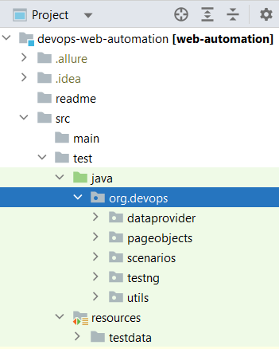

### dataprovider
Data Provider feature is used to process json files with test data and provide as inputs to the test script.
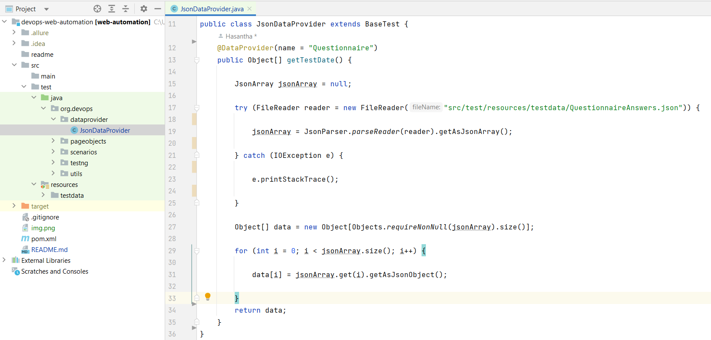

### pageobjects
pageobjects package is to maintain the classes with Page Object Models of the pages, in the given website.
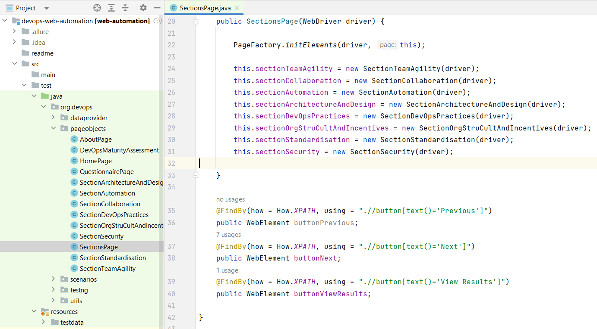

### scenarios
Test Scenarios which utilizes the POMs are maintained in this package.
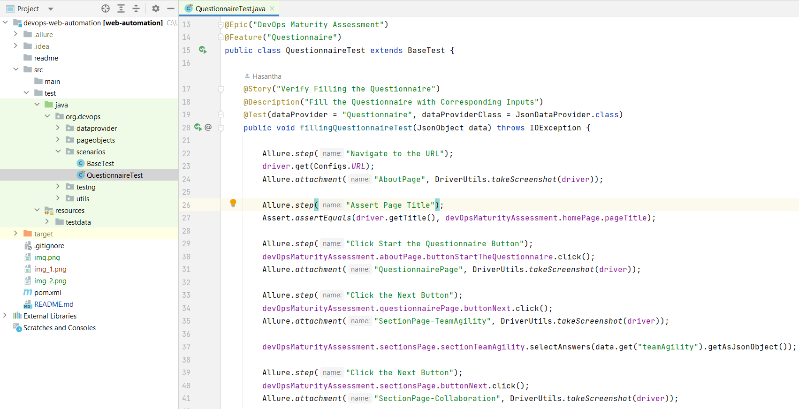

Also, a BaseTest class is used and extended in test classes to initiate the driver and hand the TestNG annotations.
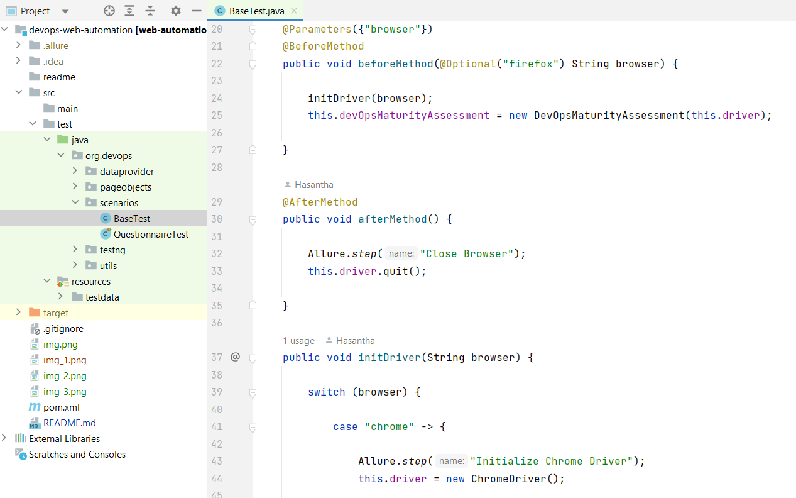

### testng
TestNG xml files for test execution are maintained in this package.
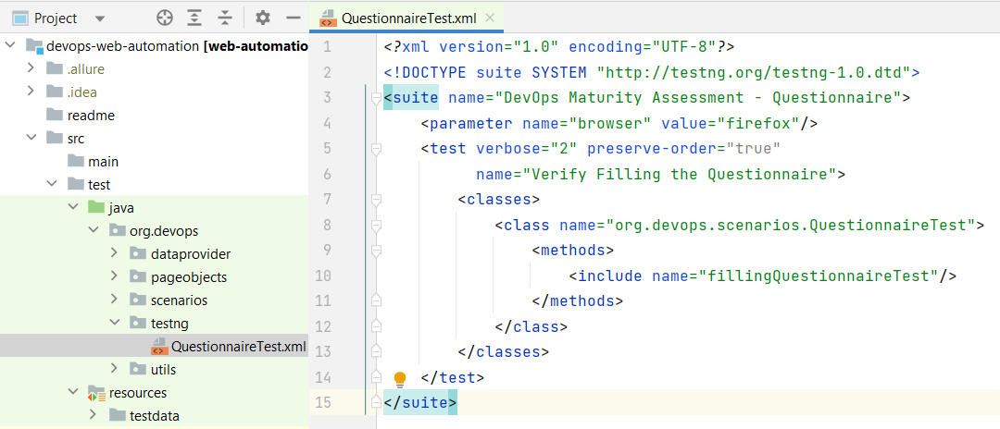

### utils
Classes with other supporting methods are maintained within this package.
Configs class is used to declare configurations/constants like the URL, etc.
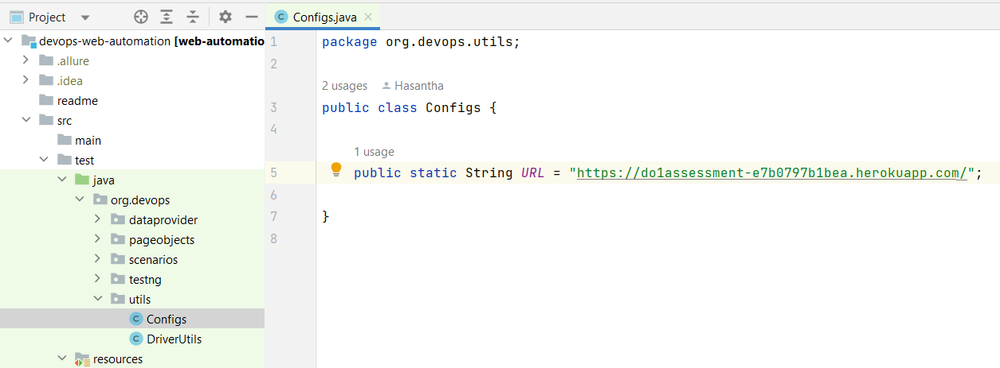

### testdata
Test Data files can be maintained in this directory. 
A Json file is used here to provide inputs to the different sections of the questionnaire.
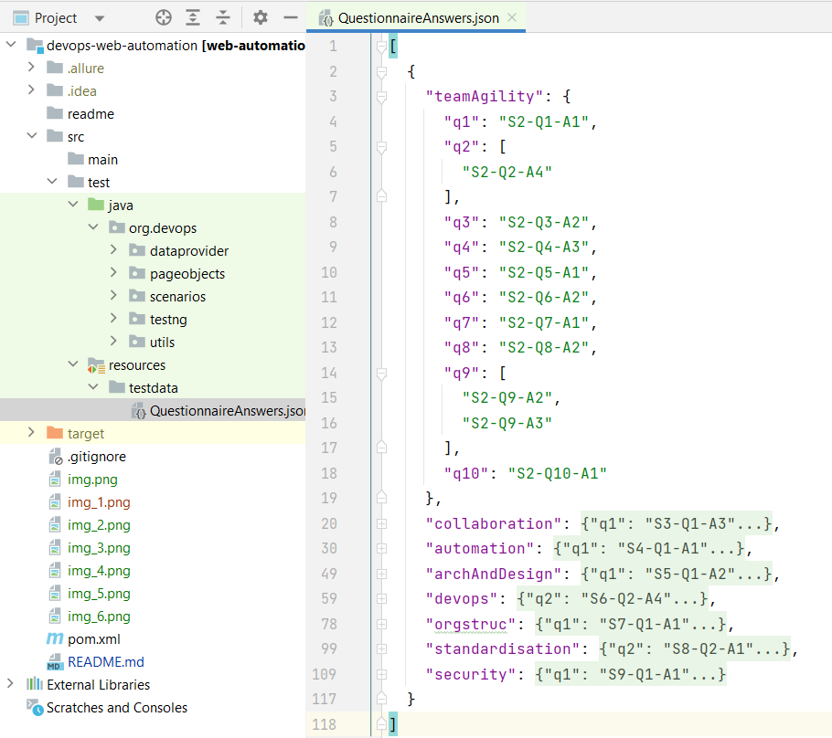

## UI Testing
* Web Elements and Operations related each page are maintained in separate classes following the Page Object Model.

* These Page Objects are called in the Test class as per the flow of testing.

* Inputs for the questionnaire is provided from the dataprovider which processes the given Json file.

* Screenshots of each webpage is captured and added as an attachment to the allure report.

## Reporting
Allure is used as the reporting tool and when the user executes mvn-site goal, it will generate the report.

### Overview

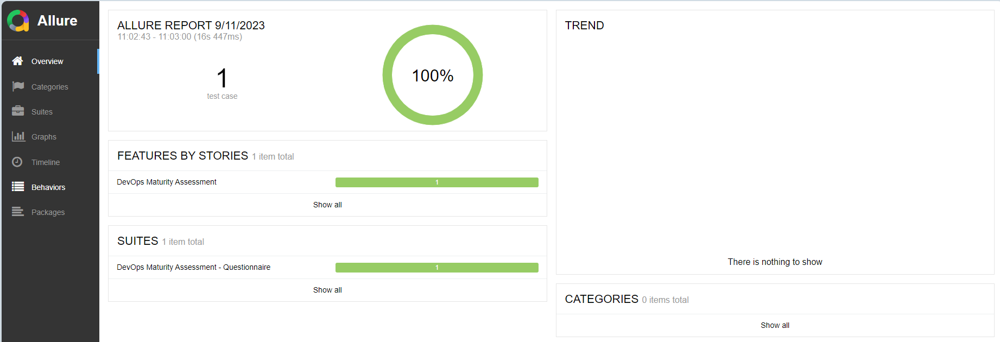

### Test Scenarios And Steps

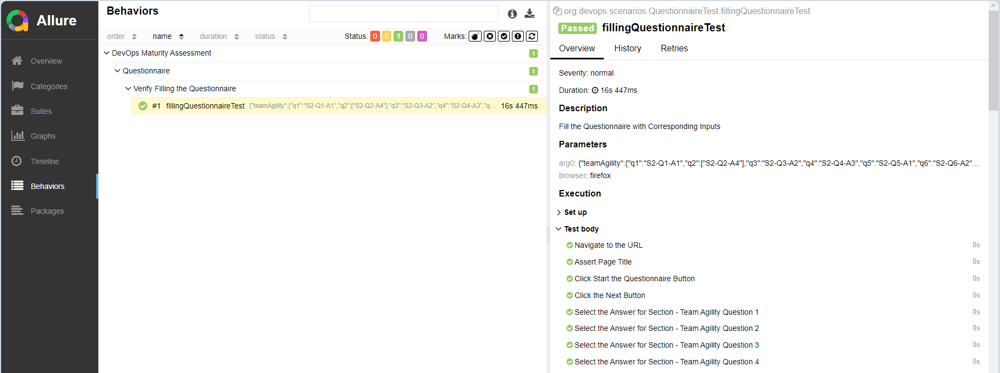

### Screenshots

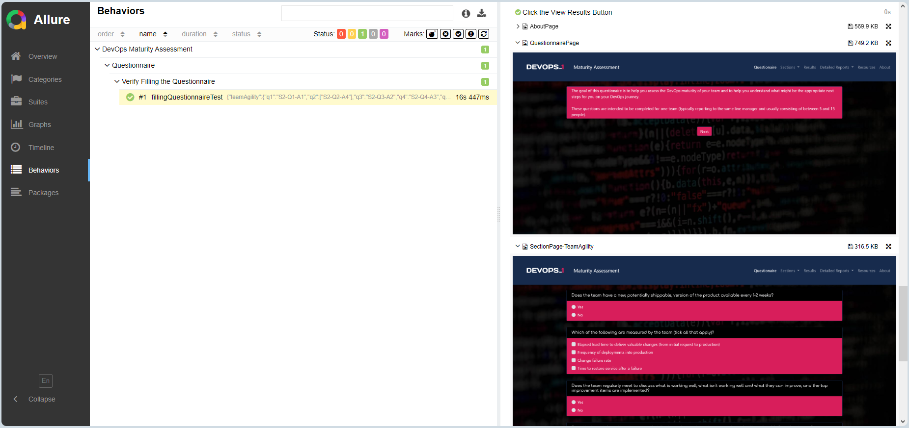